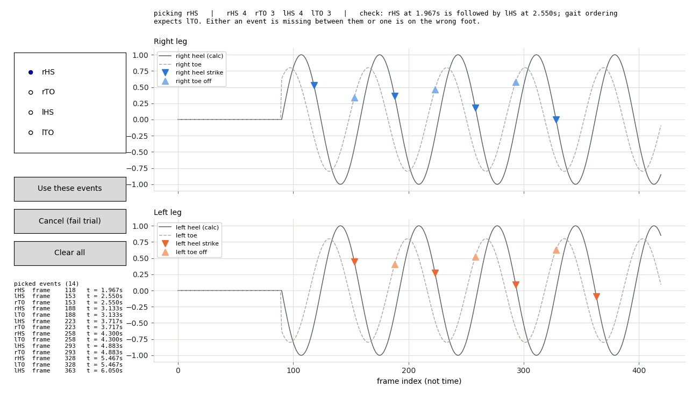

# Synergy

Joint-kinematics research project comparing two simultaneous gait-recording methods captured
while a subject walks, to compute a synergy index between them:

- **OpenCap** — video-based pose estimation feeding an OpenSim musculoskeletal simulation.
  OpenCap and OpenSim come from the same group; OpenCap handles video → human pose estimation,
  OpenSim does the biomechanical simulation (muscle activations, joint torques, moment arms,
  back-computed joint angles).
- **Xsens body suit** ("exsense" in early notes) — worn simultaneously with the OpenCap
  recording, gives joint angles directly and more precisely than OpenCap.

The current analysis pipeline is manual and takes ~15 steps per trial. The goal of this project
is to automate it: loop through a batch of recordings and run the full pipeline on each one
without hand-driving every step.

The gait-cycle-segmentation portion of the pipeline is built on top of the
[OpenCap GitHub repo](https://github.com/opencap-org/opencap-processing) (a large portion of
this codebase is inherited from there — vendored directly into this repo; see `VENDORING.md`,
and `PROVENANCE.md` for which files are upstream, supervisor-supplied, or written here),
which already contains the logic for detecting when steps happen — splitting a walking trial
into strides from heel-strike to heel-strike (heel strike → single support → swing → next
heel strike).

## Running the GUI

```
python launch_gui.py
```

Any python works -- there is no need to `conda activate` first. The launcher
finds the `opencap-processing` environment (the only place `opensim` is
installed) and re-executes the GUI under it. On Windows, `launch_gui.bat` does
the same and can be double-clicked.

Note that the **tests** run in two tiers, and the two are not equivalent. Base python
runs most of the suite and needs no OpenSim; `opencap-processing` (which has had `pytest`
since 2026-09-01) is the only tier that exercises the OpenSim-dependent tests, which
otherwise skip. See [Testing it](#testing-it) below for both invocations and what each
one covers.

```
~/miniconda3/python.exe -m pytest tests -q                          # most of the suite
~/miniconda3/envs/opencap-processing/python.exe -m pytest tests -q  # + real OpenSim
```

See `.claude/skills/run-gui/SKILL.md` for the failure modes and the
`SYNERGY_PYTHON` override.

## The gait-event picker

Some trials cannot be segmented automatically. The picker is the window an operator
gets in that case: the same curves the detector failed on, with the events placed by
hand instead. It sits inside **step 2 of the [pipeline](#pipeline) below**,
gait-cycle segmentation — everything downstream of that step depends on the events
this window produces.



*Rendered by `render_gallery.py` on deliberately awkward synthetic signals, so the
waveforms are not a real trial — the layout, controls and readouts are exactly what an
operator sees. To refresh it after changing the picker's drawing code, run
`render_gallery.py` and copy `context/render-gallery/picker_window.png` over this file;
the gallery writes to a gitignored directory, so this copy will not update itself.*

### Why it exists

Segmentation finds heel strikes and toe-offs by running `scipy.signal.find_peaks` over
four marker traces. On a clean walk that works. On some trials it does not, and
`segment_walking` escalates through a fallback chain before it gives up:

1. **Lower the peak prominence** — 0.3, then 0.25, then 0.2.
2. **Auto-trim and retry** — shorten the trial from the end and run detection again,
   repeatedly.
3. **Ask a human** — this picker.

There is no rung four. By the time the window opens, the machine has genuinely run out
of ideas, so declining fails the trial rather than falling through to something else.

**In practice almost nothing reaches rung three.** 4 of the 77 trials in `Data/` fail the
ordering check at every prominence — but that only sends them to rung two, and a scan of
all 90 processed trials on 2026-09-08 found *zero* auto-trim failures. So the picker is a
safety net that, on this dataset, has not yet had to catch anything. Which is also why it
needs the escape hatch below to be testable at all.

### What the operator sees

Two panels — right leg on top, left leg below. Each carries the heel (`calc`) and toe
traces for that leg: the **same four signals `detect_gait_peaks` runs `find_peaks`
over**. That is deliberate. Picking against a different rendering of the trial would
mean the human and the detector were answering different questions.

The x axis is the **frame index, not time**. Events are stored as frame indices the
whole way through, because `segment_walking` consumes indices — putting seconds in
between would add a conversion that can only lose precision.

### Using it

| Action | Effect |
| --- | --- |
| Radio buttons (`rHS` / `rTO` / `lHS` / `lTO`) | choose which kind of event you are placing |
| **Left-click on a panel** | place an event there |
| **Right-click on an event** | erase it |
| Hover | readout shows the frame and time under the cursor |
| Toolbar zoom / pan | navigate without depositing events |
| **Use these events** | accept the picked set and continue the trial |
| **Cancel (use auto-trim)** | decline — see below, this **fails the trial** |
| **Clear all** | reset the picked set |

**The panel you click decides the leg.** Clicking the left panel while `rHS` is
selected records a *left* heel strike, not a right one — an operator reading the left
trace means the left leg, and silently recording the other foot is exactly the class of
bug this pipeline has been bitten by before.

**Cancel is not an undo, and despite its label it does not hand the trial to auto-trim.**
Auto-trim has already failed by the time the window opens; there is nothing left to fall
back to. Cancelling empties the picker, and the trial then **fails**, carrying auto-trim's
own reason rather than a message blaming the operator for not picking. Use it to decline a
trial deliberately — not to get out of the window.

Right-click erases the nearest event **of any type** within a few frames, not just the
kind currently selected, so a stray marker can be removed without first working out which
button made it.

Two live readouts keep the operator oriented. The **status line** at the top mirrors the
pipeline's ordering rule against the current set — a duplicate of the check inside
`segment_walking`, which is not importable, held to it by a test — so you see the
pipeline's verdict while picking rather than a rejection afterwards. The **list at bottom
left** shows the picked events in time order (the most recent 18, older ones counted off),
which matters when two land within a few frames of each other and the markers overlap.

Ordering is **reported but never enforced**. A pathological gait may genuinely violate
the expected cycle, and this project stopped hard-refusing trials on 2026-08-27, so an
out-of-order set can still be saved.

### Seeing it for yourself

Because no trial in this dataset currently fails hard enough to summon the picker, waiting
for one is not a way to look at it. Set the environment variable and every trial routes
through the window instead:

```
SYNERGY_FORCE_MANUAL_EVENTS=1 python launch_gui.py            # bash
$env:SYNERGY_FORCE_MANUAL_EVENTS = "1"; python launch_gui.py   # PowerShell
```

This **forces the handover, not the answer**. Detection's result is discarded, so each
trial arrives at the picker as though no cycle had been found, but the events that come
back are the ones actually picked in the window and the trial then takes exactly the path
a genuinely unsegmentable trial would. What it cannot tell you is whether detection would
have failed on its own.

It announces itself on every trial on purpose: left set in a shell, it would turn an
unattended batch into one modal window per trial — or, with `allow_manual_entry=False`,
into a run of failures blamed on the data. Unset it when you are done looking.

### It opens on what the detector already found

Since 2026-09-08 the window arrives **seeded** with detection's own events rather than
blank. Auto-trim hands over when it cannot produce a usable gait *cycle*, which is not
the same as finding nothing — a trial yielding one heel strike and three toe-offs still
reaches the picker. Re-picking those from scratch was slower and worse: every re-picked
event is a fresh chance to click the wrong peak on a trial the machine was mostly right
about.

So the operator corrects rather than re-enters, and **accepting the seed unchanged is a
legitimate answer** — it means the detector's events were right and only the cycle-count
rule rejected them. Cancel still clears the picker, so declining still reads as a decline.

**One window per trial, not two.** A trial is analysed once per leg — the symmetry metric
is only defined by comparing both — so segmentation runs twice and an unwrapped picker
would ask the same operator the same question about the same curves twice, with no
guarantee the two answers agree. `reuse_across_legs` remembers the first answer and
applies it to the second leg. A decline is remembered too. Nothing is remembered across
trials: frame count is not identity, and two trials from one participant routinely share
one, so an unnamed trial is always asked again.

### Where it lives

| File | Role |
| --- | --- |
| `gait_event_picker.py` | the data layer — events, ordering checks, and the `rHS, lHS, rTO, lTO` tuple `segment_walking` consumes |
| `gait_event_picker_ui.py` | the window: drawing, click handling, and the `manual_event_provider` seam into `gait_analysis_UCM_fixed` |
| `gait_event_picker_tk.py` | the same picker as a modal window *inside* the clinician GUI |

Two ways of showing one picker. The standalone version ends in `plt.show()`, which
starts a Tk mainloop of its own; the clinician GUI is already running one, and two
mainloops in a process deadlock. The Tk version embeds the identical figure in a
`Toplevel` and blocks with `wait_window` instead. Both build the view through the same
`build_picker_view`, so they cannot drift apart.

The window must be created **on the main thread** — building it from the GUI's pipeline
worker deadlocks. The worker therefore posts a `ManualEventRequest` onto the pipeline
queue and waits; `clinician_gui` picks it up in its `root.after` poll, which is the main
thread, and opens the window there.

### Two things a reviewer should know

**The model is separable from the window.** `EventPickerModel` holds every decision —
which frame a click means, what the summary says, what the ordering verdict is — and
touches no matplotlib. That is the only reason any of this is testable on a machine with
no display, which is every machine that runs the test suite.

**A non-interactive backend is refused before anything is drawn.** `plt.show()` returns
immediately under Agg, so the operator would never see a window and whatever the picker
held would be passed off as their answer. `make_reports.py` and
`make_comparison_figures.py` both force Agg process-wide at import, so a notebook or REPL
that imports either and then picks would hit this — no code path in the repo does today,
but the guard costs nothing and the failure it prevents is invisible.
`assert_interactive_backend` raises instead.

### Testing it

The picker's tests run in both tiers this repo uses:

```
~/miniconda3/python.exe -m pytest tests -q                        # no OpenSim needed
~/miniconda3/envs/opencap-processing/python.exe -m pytest tests -q  # real OpenSim + Data/
```

Most coverage is fixture-based and runs anywhere, including CI.
`tests/test_gait_event_picker_real_data.py` drives the picker against the real `.trc`
files, and `tests/test_gait_analysis_picker_end_to_end.py` drives it through real
`segment_walking`; both skip on a fresh clone, because `Data/` is gitignored.

## Pipeline

1. **Xsens → OpenSim format.** Convert Xsens kinematics (`.mvnx`) into the `.mot` format
   OpenSim expects, so Xsens data can run through the same downstream code as OpenCap data.
   Requires mapping each Xsens joint to its corresponding OpenCap/OpenSim joint (currently done
   in MATLAB).
2. **Gait-cycle segmentation.** Feed the `.mot` file into the existing OpenCap-derived code that
   finds heel-strike events and splits the trial into 0–100% gait cycle, per joint, producing a
   table of motion files.
3. **Apply to scaled model.** Use a subject-scaled OpenSim model (scaled by height/weight) with
   both the OpenCap-derived and Xsens-derived motion data, so the two sources are comparable on
   the same model.
4. **Repackage into an OpenCap session.** OpenCap sessions download as a zip with a 32-char
   session-ID descriptor. Extract it, replace the motion files inside the kinematics folder
   (one subfolder for OpenCap results, one for Xsens-derived results), then re-zip for upload
   back into the gait analysis backend.

## Open concerns — read this first

**The model was never posed to match the IMU calibration frame.** Found and fixed 2026-09-02.
Mechanism, evidence and the numbers are in `VENDORING.md` under "The calibration pose was never
set, and the arms paid for it".

`IMUPlacer` computes each body-to-IMU offset against the OpenSim model's **default** pose — it
never solves for the subject's. The calibration row we hand it is the .mvnx's **T-pose** (all 90
trials in this study carry one; none carry an N-pose), and `LaiUhlrich2022`'s default pose is
arms-down. The 90 degrees of shoulder abduction between the two went into the arm IMU offsets, so
IK had to report a walking arm as ~90 degrees abducted. That is gimbal lock for the shoulder's
Euler triplet, and `arm_flex`/`arm_rot` then wound up against the model's own **+/-572.96 degree
(+/-10 rad)** coordinate bounds — roughly three full shoulder revolutions of slack, which is why
the symptom read as "the arm angles are 180 degrees too high" rather than as an obvious failure.

Fixed by posing the model in the calibration frame's own pose before `IMUPlacer` runs
(`xsens_to_opensim.CALIBRATION_POSES`). Checked against Xsens's own `<jointAngle>` solver, which
shares none of this machinery: AN's right forearm pronation is 112.2 deg by Xsens, was 6.6 deg on
the IK route, and is now 115.1 deg; right elbow flexion is 8.5 deg by Xsens, was pinned at 0.02
deg, and is now 6.4 deg. Across-stride arm SDs fall from 2-157 deg to 1-3 deg, the same range as
the marker-based OpenCap route.

**Scope: arms only.** Pelvis and both legs hold the same pose in a T-pose as in the model default,
so their offsets were already right — measured shift on the regenerated exports is under 0.25 deg
(p99). Nothing in the gait metrics, GDI or the synergy index changes. The lumbar coordinates do
move a little, and that is the fix working: `torso_imu`'s tracking residual drops from 1.00 to 0.07
deg RMS once the arm frames stop pulling on the torso in the global IK solve.

**Audited across all six sessions on 2026-09-03.** Upper-body IMU residual 12.23 deg -> 8.10 deg
over 90 trials; lower body identical at 3.60 deg, which is the regression evidence. One trial
regressed: **MS-005's left arm is lost from t = 4.35 s** (humerus residual 16 -> 59 deg RMS) and its
arm/elbow/forearm kinematics must not be used -- its legs are unaffected, so it stays usable for
GDI and the synergy index. KM's right hand tracks poorly in nine trials, before and after, which is
a separate pre-existing defect. Full audit in `VENDORING.md`.

**Any arm, elbow or forearm value produced before 2026-09-02 is superseded.** Pre-fix outputs are
kept per session as `pre-calibration-fix/` rather than deleted. `verify_calibration_fix.py` is the
cohort-wide gate. The `xtoo` route was never affected — it does not run `IMUPlacer`.

**One thing the fix does not solve:** `pro_sup` now reaches the model's 119.75 deg limit for AN.
Xsens puts that subject's forearm pronation at up to 142 deg, so the model's range is genuinely
narrower than the movement rather than the calibration being wrong. It is reported, not widened —
a +/-10 rad shoulder range is exactly what let the original defect hide for two weeks.
**The foot progression angle was never referenced to the walking direction.** Found 2026-09-01.
Full write-up with every measurement in
[`docs/2026-09-01-fpa-heading-concerns.md`](docs/2026-09-01-fpa-heading-concerns.md); provenance in
`VENDORING.md` under edit #15.

`getpelvis` derives the direction the subject walked as
`arctan2(y_end - y_start, x_end - x_start)`. OpenSim's ground frame is X forward, **Y vertical**,
Z lateral — walking is in X-Z. As written it measures forward travel against vertical bounce, so
FPA has never been expressed relative to the direction of travel. It looks plausible because the
answer is always near zero, which is approximately right whenever a subject walks straight along
+X.

Two consequences, one of which is not confined to this repository:

| where | effect | size |
|---|---|---|
| **Upstream OpenCap results** (root translates) | constant bias per trial | **5.26 deg mean, 6.55 max** over 10 trials |
| **This project's IMU route** (root pinned) | `arctan2(0, 0) = 0`, so FPA becomes absolute foot yaw and tracks heading drift | **up to 30 GDI points** within one session |

Across six participants, `|pelvis heading drift|` predicts the within-session change in GDI at
**r = -0.947, about -0.72 points per degree**; four of six sessions carry 10-36 degrees of drift.

Repaired by measuring the heading in the ground plane, falling back to pelvis yaw where the root
does not translate. Everything else was deliberately left alone — the `+/-5` degree foot offsets,
the mirrored left/right sign, one heading per trial, and FPA's place in the GDI feature set.

**The correction does not improve every number, which is the main reason to trust it.** One
participant's drift is driven by hip flexion rather than FPA and is untouched to two decimal
places; another retains a genuine right-foot divergence that is visible in the raw recording. A fix
that cleaned those up as well would have meant real signal was being flattened.

**Any GDI or FPA value produced before 2026-08-31 is superseded.** Pre-fix curve exports are kept
per session as `GaitCurves_pre-fpa-fix/` rather than deleted.

Two questions for whoever maintains the upstream code, both in the write-up: what the `+/-5` degree
foot offsets encode (no derivation found anywhere), and whether anything downstream was tuned
against the old near-zero heading.

**GDI reads roughly normal across the cohort; two subjects sit low.** Corrected 2026-09-03 --
an earlier version of this section claimed the pipeline carried a systematic ~20-point offset
against the published scale. **That claim was wrong**, and it was wrong because it generalised from
three subjects who turned out to be the low tail. Over all six processed sessions, scored on
`reduced6` against `context/gdi_reference_2026-08-27`:

| session | left | right | pooled | 95% CI | verdict |
| --- | --- | --- | --- | --- | --- |
| SB | 98.96 | 106.13 | **102.35** | 101.1-104.0 | sound |
| HH | 98.89 | 97.82 | **98.32** | 97.7-99.4 | sound |
| MS | 104.79 | 91.35 | **98.31** | -- | inconclusive -- legs disagree by 13.4 |
| KM | 93.34 | 88.41 | **90.96** | 89.7-92.2 | inconclusive -- straddles the floor |
| AN | 87.60 | 85.56 | **86.64** | 85.3-87.9 | inconclusive |
| CK | 85.22 | 83.36 | **84.30** | 82.8-86.0 | inconclusive -- straddles the ceiling |

Intervals are over trials, not strides: strides within a trial are strongly correlated, so a
standard error over them would be several times too tight. Three of these were more confident before
that was fixed -- KM read "sound" on a point estimate one point clear of the floor, and CK read
"action required" one point clear of the ceiling.

Cohort mean **93.45 +/- 7.44**, range 83.36-106.13 -- within one SD of the normative 100 +/- 10.

**A uniform offset is disfavoured, and cannot be ruled out from this data at all.** If the pipeline
subtracted ~20 points from everyone, the true values would run 103.36-126.13 -- all twelve limbs at
or above the normative mean. That is unlikely for a group of unknown clinical status, but the
calculation assumes a sampling model these six sessions do not have, so it is not a usable
likelihood ratio.

The deeper point, and the one that governs what any future analysis can achieve: **without
known-uninjured calibration data through this pipeline, "true score" and "additive pipeline offset"
are not separately identifiable.** Every observed score is consistent with a continuum of (true
ability, offset) pairs, and no quantity of unlabelled sessions decomposes it. Audit sections 14-15
state this in full, including a category error section 13 made in citing per-session SOUND verdicts
for subjects whose health is not recorded. So the control capture is not a confirmation of a settled
result -- it is the only thing that identifies the model.

**So low scores, where they can be placed at all, look subject-specific.** CK at 84.30 and AN at
86.64 are low for reasons particular to those subjects -- real impairment, or that subject's tracking quality -- not because the scale is
shifted. The pipeline is stable across routes: CK measures 84.62 through `context/gait_curves` and
84.30 through the session route.

**Residual coordinate differences exist and do not explain the scores.** Measured over all six
sessions (180 curve files) against the cohort, `hip_flexion` runs -10.57 deg and `fpa` +4.78,
summing to 20.0 deg across the six non-pelvis variables. (An earlier 33.1 deg figure came from the
same three-subject sample and is superseded.) Those are mean-level differences in individual
coordinates; GDI is a distance in a 15-dimensional projected space, so they do not simply add up
into a score deficit -- and empirically they do not, since the cohort still centres near 100.

**What this means in practice.** Relative comparison -- trial to trial, leg to leg, session to
session -- was never in question. A single low session is better read as a finding about that
session than about the pipeline. What is *not* established is that the pipeline is free of any scale
offset -- a smaller or subject-varying one remains consistent with everything measured -- nor any
individual subject's clinical status. One subject known to be uninjured, run through
`validate_control_baseline.py`, is still the clean settle and is cheap.

**Do not fit a global offset to our participants.** Still true, and now for a second reason: there
is no uniform offset to fit, and mean-matching a subject group onto a control reference removes
exactly the between-subject differences the score exists to detect.

**Checking one session — `validate_control_baseline.py`.** Originally written to settle the
pipeline-offset question; that question is answered, so it now serves as a per-session diagnostic
for outliers and asymmetry.

```bash
python validate_control_baseline.py     --session PATH/TO/SESSION     --reference context/gdi_reference_2026-08-27
```

| code | verdict | meaning |
| --- | --- | --- |
| 0 | SOUND | pooled >= 90 |
| 1 | ACTION REQUIRED | pooled <= 85; investigate that subject's data quality |
| 2 | INCONCLUSIVE | the 85-90 band, **legs disagreeing by more than one normative SD**, or fewer than 8 strides |
| 3 | UNABLE TO RUN | missing reference, invalid session, or a pelvis-bearing feature set |

The asymmetry guard is the most useful of these in practice: it is what flags MS, whose legs differ
by 13.4 points (104.79 vs 91.35) while the pooled mean of 98.31 looks unremarkable. A pooled mean
alone would have hidden that.

**`gdi9` is disabled** and raises `GdiFeatureSetDisabledError` from both `get_feature_set` (by name,
the CLI path) and `compute_gdi` (as an object). Its pelvis terms carry a convention mismatch against
the reference cohort -- `pelvis_tilt` runs +10.27 deg -- with no offsetting benefit. `reduced6` is
the default and the only set the project reports through. This is not waivable, unlike
`check_digest`: a disabled set's output is wrong in a known direction, and there is no honest reason
to want that number.

## Known issues / open problems

- **An intermittent native crash with no Python traceback.** Trials occasionally exit with
  `3221226505` (`STATUS_STACK_BUFFER_OVERRUN`). It is *not* tied to particular trials — one that
  crashed in a batch completed on the next run. Each trial now runs in its own process so a crash
  costs one trial rather than the whole batch; the cause is still unknown.
- **`AnalyzeTool` is run but its result is never read.** `getpelvis` constructs one, runs it, then
  recomputes everything itself from the `.mot`. Roughly 17 s per trial — about a quarter of the
  per-trial cost — with no observable use. Left in place in case of a side effect.

- **Zip handling is fragile.** File-finding by name (motion files, session metadata) breaks if
  filenames get mangled on re-zip, or if files end up nested deeper than the code expects.
- **Session ID parsing is inconsistent.** The session ID must be retained in the filename, but
  the format varies — ID alone, ID + `.zip`, or an extra underscore — and index-based parsing
  is the main source of bugs here.
- **Login requirement.** The gait-analysis backend requires being logged in as the account that
  originally recorded the session, so the pipeline currently has to log in as that user each run.
- **No direct motion-file import.** Raw motion files can't be imported straight into OpenCap —
  inverse kinematics has to be re-run manually to regenerate marker positions, and the
  resulting timescale/resolution don't line up cleanly with the original recording.
- **Manual file selection.** Selecting which Xsens/OpenCap folder to convert still requires
  typing exact folder names; there's no directory picker or cycling through a folder of trials
  yet.
- **Tight coupling to local/manual execution.** Large parts of the current workflow are
  intertwined with running code interactively in a local console, which makes batch automation
  difficult without a rework.

## Recent progress

- Added the ability to download session data directly (instead of only working from a
  pre-downloaded zip) and to re-evaluate past sessions.
- Moved the main trial-selection while-loop so it no longer re-lists/re-prompts on every pass
  when running multiple trials back to back.
- Vendored the OpenCap `opencap-processing` codebase into this repo and overlaid the
  Synergy-specific edits (`utils.py`, `utilsKinematics.py`, `Examples/gaitAnalysis-UCM.py`).
- Replaced pipeline step 1 (the manual MATLAB joint-mapping + `getMarkers.py`'s
  forward-kinematics marker-reconstruction workaround) with `xsens_to_opensim.py`, built on
  OpenSim's own OpenSense framework. Also writes `.trc` marker files directly (no MATLAB, no
  marker round-trip) and can write output straight into an existing OpenCap session's own
  folder layout. `getMarkers.py`, `utils_UCM.py`, and `utilsKinematics_UCM.py` were removed as
  dead weight once superseded — see `VENDORING.md` for the full history and reasoning.
- `gait_analysis_UCM.py` (the gait-cycle scoring class) has been supplied. A bug-fixed copy,
  `gait_analysis_UCM_fixed.py`, addresses issues found in review — see `VENDORING.md`.

## Status

The OpenCap base is vendored in and the known Synergy-specific edits are layered on top. See
`VENDORING.md` for what's still missing before this runs end to end.

## Credentials

Do **not** commit credentials to this repo. Use environment variables or a local, gitignored
secrets file instead.
