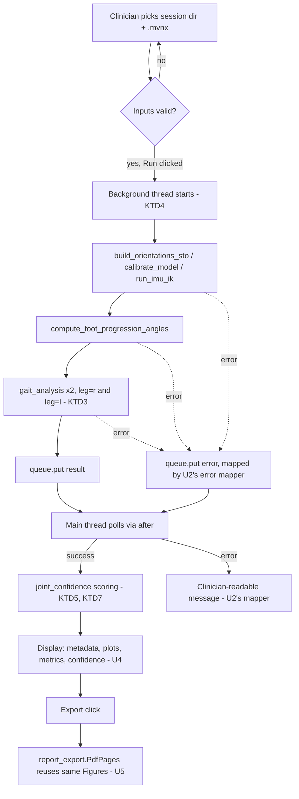

# Clinician Trial Report GUI - Plan

## Goal Capsule

- **Objective:** Give a clinician a GUI that runs a new Xsens trial through the existing conversion/analysis pipeline and shows joint-angle plots, gait metrics, and a per-trial confidence indicator, with one-action PDF export — no command line.
- **Product authority:** this brainstorm dialogue (single work unit; no broader request split). The Product Contract wins on product behavior; Planning Contract KTDs win on implementation mechanism within those constraints; unit Approach fields carry unit-local detail only.
- **Open blockers:** none.
- **Stop conditions:** surface a blocker rather than guessing if implementation would require editing the coworker's vendored files (`utils.py`, `utilsKinematics.py`, `gait_analysis_UCM.py`/`gait_analysis_UCM_fixed.py`, `getMarkers.py`) directly, or if the existing `opencap-processing` conda env doesn't actually work as `VENDORING.md` documents.
- **Execution profile:** normal code implementation in this repo's existing conda env; no packaging, no autonomous long-running rollout.
- **Tail ownership:** implementer decides commit/PR strategy per repo convention (this repo has no remote yet); no autonomous shipping required by this plan.

## Product Contract

### Summary

A GUI that takes an existing OpenCap-style session plus a new Xsens `.mvnx` trial, runs the existing conversion (`xsens_to_opensim.py`) and gait analysis (`gait_analysis_UCM.py`) against it, and displays the trial's metadata, joint-angle curves, gait-cycle metrics, and a computed per-segment confidence indicator — exportable to PDF in one action. Targets the existing `opencap-processing` conda env on this machine; distribution to clinician-owned machines is a separate, later plan.

### Requirements

**Pipeline execution**
- R1. The GUI accepts an existing OpenCap-style session directory and a new Xsens `.mvnx` file as the input for a run.
- R2. The GUI runs `xsens_to_opensim.py`'s OpenSense-based conversion and `gait_analysis_UCM.py`'s gait analysis against that input, writing output into the session directory using the existing `resolve_session_output_paths` layout.
- R3. The GUI sets a placeholder `API_TOKEN` environment variable before importing anything that imports `utils.py` (including `gait_analysis_UCM.py`), so the import-time OpenCap login prompt never fires.
- R4. The GUI shows visible progress while the pipeline runs.
- R5. A pipeline failure (bad input, missing model, malformed `.mvnx`) surfaces as a clinician-readable message in the GUI, not a raw traceback or a silent hang.

**Report content**
- R6. On a successful run, the GUI displays session/trial metadata: subject/session ID, trial name, date, duration, and sensor coverage.
- R7. The GUI displays joint-angle curves over time for the trial's key joints, sourced from the pipeline's `.mot` output.
- R8. The GUI displays the gait-cycle scalar metrics already computed by `gait_analysis_UCM.py` (e.g., stride length, cadence, ROM, symmetry).
- R9. The GUI computes and displays a per-segment confidence indicator by comparing this pipeline's joint angles against the suit's own onboard joint-angle estimate (already extractable from the `.mvnx` via `parse_mvnx`'s `STANDARD_22_JOINT_ORDER`/`JOINT_ANGLE_DOF_NAMES` support), labeled as agreement with the suit's own estimate rather than as ground-truth accuracy.

**Export**
- R10. The GUI exports the currently reviewed trial's report (metadata, joint-angle plots, gait metrics, confidence indicators) to a single PDF file in one action.

### Key Decisions

- **Run the pipeline end-to-end inside the GUI, not a pure results viewer.** (session-settled: user-directed — chosen over a view-only tool that assumes the pipeline already ran: clinicians shouldn't need a separate CLI step.) Governs R1, R2.
- **Work around the import-time OpenCap login prompt with a launcher-level `API_TOKEN` placeholder, not a change to the coworker's files.** (session-settled: user-directed — chosen over leaving it undocumented: a GUI has no terminal for the prompt to appear in.) Governs R3.
- **Surface leg-tracking uncertainty as a computed per-trial confidence indicator, not static disclaimer text.** (session-settled: user-directed — chosen over a static caveat: gives a trial-specific signal and reuses joint-angle data the pipeline already extracts.) Governs R9.
- **Input is an existing OpenCap session plus a new `.mvnx` trial, not a from-scratch raw file.** (session-settled: user-directed — chosen over accepting a raw `.mvnx` alone: avoids inventing subject-specific model scaling the current pipeline doesn't support.) Governs R1, R2.
- **Packaging for clinician-owned machines is a separate, later plan.** (session-settled: user-directed — chosen over including distribution now: OpenSim's pinned conda env is a multi-day packaging problem on its own and would block a working tool.)

### Key Flows

- F1. **Run a new trial and review results**
  - **Trigger:** Clinician selects an existing OpenCap session directory and a new `.mvnx` file, then starts the run.
  - **Steps:** GUI shows progress while the conversion and gait analysis run; on completion it displays metadata, joint-angle plots, gait metrics, and confidence indicators.
  - **Outcome:** Clinician reviews the trial's results without touching a command line.
  - **Covers:** R1, R2, R4, R6, R7, R8, R9.
- F2. **Export the reviewed report to PDF**
  - **Trigger:** Clinician clicks export after reviewing a completed run.
  - **Steps:** GUI renders the displayed metadata, plots, metrics, and confidence indicators into a PDF file.
  - **Outcome:** A shareable, archivable PDF exists on disk.
  - **Covers:** R10.
- F3. **Handle a failed run**
  - **Trigger:** Conversion or analysis raises an error (bad input, missing model, malformed `.mvnx`).
  - **Steps:** GUI catches the error and shows a readable message instead of crashing or hanging.
  - **Outcome:** Clinician understands the run failed and roughly why.
  - **Covers:** R5.

### Acceptance Examples

- AE1. **Covers R5.** Given a session directory with no `.osim` model file, when the clinician starts a run, then the GUI shows a readable error message and does not crash.
- AE2. **Covers R3.** Given no `API_TOKEN` environment variable set on the machine, when the GUI runs a trial, then no interactive login prompt appears and the run proceeds.
- AE3. **Covers R9.** Given a trial with large knee-flexion excursion, when the GUI computes the confidence indicator, then the femur/tibia segments show lower confidence than torso/pelvis, consistent with the calibration-distance effect documented in `VENDORING.md`.
- AE4. **Covers R4.** Given a run that takes more than a few seconds, when the clinician is waiting, then the GUI shows visible progress rather than an unresponsive window.

### Success Criteria

- A clinician with no Python or command-line experience can take a new `.mvnx` recording, run it, and produce a PDF report, without assistance beyond this tool's own UI.

### Scope Boundaries

**Deferred for later:**
- Packaging/installer so the tool runs on a clinician's own machine without the existing conda env.
- Cross-visit / longitudinal trend comparison across multiple trials for the same patient.
- Changing the underlying leg-tracking calibration or accuracy itself (e.g., a functional/dynamic calibration) — this feature only measures and reports today's accuracy.
- Ground-reaction-force-based internal joint torque analysis (open item noted in `VENDORING.md`, unrelated to this feature).

**Deferred to Follow-Up Work:**
- Refactoring `utilsPlotting.py`'s existing plot styling into a shared module with this GUI's plots — not needed for correctness, noted during planning research.
- Automated headless testing of actual Tk widget rendering — this plan tests the underlying data-shaping/logic functions directly instead (see Verification Contract) and treats full-window rendering as a manual smoke check.
- A cancel/abort control for an in-progress run, and versioned (rather than overwriting) output when re-running a trial against a session that already has output for it — both noted during doc review; KTD4 and KTD8 record the simpler v1 behavior (Run disabled during execution, no cancel; overwrite on re-run) as deliberate, not accidental, omissions.

### Dependencies / Assumptions

- Assumes the existing `opencap-processing` conda env (OpenSim 4.5, `py311`, pinned `numpy`/`scipy`/`pandas` per `VENDORING.md`) already works on this machine; this plan doesn't fix or re-pin it.
- Assumes each patient already has one OpenCap session with a scaled model before any Xsens trial is processed through this tool — confirmed: every participant goes through OpenCap first, though not every participant has an Xsens recording (so this tool applies to a subset of sessions, not all of them).
- Assumes the target session's `.osim` model is discoverable per `resolve_session_output_paths`'s existing auto-discovery rule (exactly one `.osim` in the session, or an explicit override).

### Sources / Research

- `VENDORING.md` — pipeline history, the login-coupling discovery (`utils.py:41`), the leg-tracking-error-vs-calibration-distance finding (real per-segment RMS-error table), and the `resolve_session_output_paths` output layout.
- `xsens_to_opensim.py` — existing conversion pipeline; `main()` (937-1090), `resolve_session_output_paths()` (883-934), `build_orientations_sto()` (539-685), `calibrate_model()` (688-715), `run_imu_ik()` (718-750), and `parse_mvnx()` (280-511) with `STANDARD_22_JOINT_ORDER`/`JOINT_ANGLE_DOF_NAMES` already extracting the suit's own joint-angle estimate alongside segment orientations (verified by inspection: no existing reusable comparison/confidence function yet — R9 is new logic on top of that extraction).
- `gait_analysis_UCM_fixed.py` — the corrected copy of the gait-cycle scalar-metric computation this GUI calls into (see Planning Contract KTD3 for why the fixed copy, not the original `gait_analysis_UCM.py`).
- `Examples/gaitAnalysis-UCM.py` — `run_gait_analysis()` (line 327) as the existing orchestration template for driving `gait_analysis`; `compute_foot_progression_angles()` (line 230); tkinter file-picker precedent (`_select_zip_interactively`/`_select_extracted_folder_interactively`, lines 499-520).
- `utils.py:41` / `utilsAuthentication.py:30` — confirmed exact mechanism of the import-time `API_TOKEN` login-prompt coupling.
- `tests/` — existing pytest conventions this plan's new tests follow: `importlib.util.spec_from_file_location` module loading, `monkeypatch.setitem(sys.modules, 'opensim', ...)` stubbing (never raw assignment), synthetic `tmp_path` fixtures over real data.

---

## Planning Contract

**Product Contract preservation:** unchanged. R2/R8's generic references to "`gait_analysis_UCM.py`'s gait analysis" are clarified, not altered, by KTD3 below — the same capability, correctly targeting the fixed copy. A post-review pass also corrected several Planning Contract/Implementation Unit details (unit-to-file-citation errors, a missing two-leg instantiation for R8's symmetry metric, R9's missing no-data fallback, R3's guard moved to the unit that actually creates the file, U6 folded into U2) — none of these touch Product Contract text or R-IDs.

### Key Technical Decisions

- KTD1. **GUI framework: tkinter/`ttk`, with matplotlib figures embedded via `FigureCanvasTkAgg`.** (session-settled: user-approved — chosen over a more polished toolkit: zero new dependency, matches the one existing GUI precedent in `Examples/gaitAnalysis-UCM.py`, no change to the pinned conda env; trades visual polish for that.) Governs R1, R6, R7, R8, R9.
- KTD2. **PDF export via `matplotlib.backends.backend_pdf.PdfPages`, reusing the same on-screen `Figure` objects.** (session-settled: user-approved — chosen over reportlab/fpdf: matplotlib is already a hard dependency, so this adds nothing to `requirements.txt`; layout is one section per page rather than a fully designed report.) Governs R10.
- KTD3. **Call `gait_analysis_UCM_fixed.py`'s `gait_analysis` class twice per trial (`leg='r'` and `leg='l'`, both fed the same foot-progression-angle inputs), not the original `gait_analysis_UCM.py`, with `allow_manual_entry=False`.** (session-settled: user-approved — chosen over the original file: `VENDORING.md` documents the original as buggy when imported directly, and the fixed copy is what `Examples/gaitAnalysis-UCM.py`'s own driver actually imports; `allow_manual_entry=False` turns a blocking interactive `input()` prompt on failed gait-event detection into a catchable exception, required for R5. Two instantiations — matching `run_gait_analysis()`'s own pattern — because R8's symmetry metric is defined only by comparing both legs' results; a single instantiation cannot produce it.) Governs R2, R5, R8.
- KTD4. **Pipeline execution runs on a background `threading.Thread`; progress and results reach the Tk main loop through a `queue.Queue` polled via `root.after(...)`. The Run control is disabled for the duration of the run; no cancel/abort action.** (session-settled: user-approved — chosen over running the pipeline on the main thread: a run can take from seconds to over a minute, including a `compute_foot_progression_angles` pass that itself runs an `osim.AnalyzeTool` call, and blocking the Tk event loop would freeze the window with no way to show progress. Cancel is out of scope for v1 — disabling Run for the run's duration is the simplest correct behavior; see Scope Boundaries.) Governs R2, R4.
- KTD5. **Confidence indicator: a new Xsens-joint-name-to-OpenSim-coordinate-name mapping (duplicated into `joint_confidence.py` from `Examples/gaitAnalysis-UCM.py`'s `JOINT_NAMES`, not imported from it — see KTD9), scored by angular difference between `parse_mvnx`'s `joint_angles` and the matching `.mot` coordinate after time-base alignment (KTD7), tiered against `VENDORING.md`'s real per-segment RMS-error table.** (session-settled: user-approved, instantiating the Product Contract's confidence-indicator Key Decision — chosen over inventing arbitrary thresholds: grounds the tiers in the one real validation study this repo already has. Note the two measurements are related but not identical — VENDORING.md's table is IMU-orientation RMS error, while this computes onboard-jointAngle-vs-`.mot` difference — so the tiers are an approximation, not a direct fit; revisit cutoffs if real trials show the tiering doesn't track actual leg-tracking quality.) Governs R9.
- KTD6. **Set a placeholder `API_TOKEN` environment variable at the very top of the GUI's entry-point module (`clinician_gui.py`), before any import that transitively reaches `utils.py`.** (session-settled: user-directed, inheriting the Product Contract's login-coupling Key Decision.) Governs R3.
- KTD7. **Confidence-indicator time alignment: resample the lower-rate series (typically the `.mot` output) onto the higher-rate series's timestamps via linear interpolation before computing angular difference, rather than comparing by frame index.** Xsens frames are elapsed-milliseconds-indexed; `.mot` rows are indexed by the IK solve's own time step — the two are not guaranteed to share a rate or offset, and comparing by raw index would inject timing noise into every score. Interpolation is the standard, simplest correct fix and needs no new dependency (`numpy.interp`). Governs R9.
- KTD8. **Re-running a trial against a session directory that already has output overwrites the prior `.mot`/plots/metrics/PDF for that trial name, matching `resolve_session_output_paths`'s existing behavior (it names outputs by trial name, not run timestamp).** No versioning or confirmation prompt in v1. Chosen over silent surprise: the GUI shows the trial name before Run so the clinician sees what will be (re)written; anything more (confirm-before-overwrite, versioned filenames) is deferred — see Scope Boundaries. Governs R2.
- KTD9. **New tests for U2's gait-analysis stage mock `gait_analysis_UCM_fixed.gait_analysis`'s return value rather than driving the real class through synthetic marker/coordinate data.** No test in this repo has ever exercised `gait_analysis`'s real gait-event peak detection end-to-end, and building fixtures reliable enough to pass it is a nontrivial, separate effort from proving this GUI's own orchestration, error-mapping, and progress-reporting logic. Governs R2, R4, R5.
- KTD10. **The centralized error-to-message mapper lives inside U2 (the unit that runs the pipeline and can catch its own failures), not as a separate implementation unit.** (session-settled: user-approved — chosen over splitting error-mapping into its own unit: an earlier draft split R5 across two units touching the same file with no real boundary between them; folding them removes duplicated logic and an ambiguous ownership split, per doc review.) Governs R5.

### High-Level Technical Design

### Assumptions

- The `opencap-processing` conda env already has `opensim`, `matplotlib`, `pandas`, `scipy`, `numpy` at the pinned versions `VENDORING.md` documents — no new installs.
- `resolve_session_output_paths`'s single-`.osim`-file auto-discovery is sufficient for every session this tool targets (per the Product Contract's confirmed assumption that every patient goes through OpenCap first).
- No explicit lower/upper bound on trial length or frame rate is enforced. The pipeline's only real-world validation is one 43-second, 2609-frame trial; an unusually short or sparsely-sampled trial may leave too few aligned samples (post-KTD7 resampling) for a meaningful confidence tier on some segments — U3 reports those as "not scored" (same path as an unmapped segment) rather than guessing, so a degenerate case degrades gracefully instead of failing.

### Risks & Dependencies

- **Risk:** `compute_foot_progression_angles` runs a real `osim.AnalyzeTool` pass, adding real per-run latency beyond the IMU-IK stages alone — makes R4's progress feedback more load-bearing, not just a nicety. Mitigated by KTD4's threading.
- **Risk:** the confidence indicator's reference point is the suit's own onboard algorithm, not an independent ground truth (see Product Contract Key Decision on this) — a real interpretive limitation, not a bug, but worth the implementer keeping the label wording ("agreement with the suit's own estimate") intact wherever the score is surfaced.
- **Risk:** Tk widget rendering is not practically unit-testable headlessly on this platform — mitigated by testing data-shaping/logic functions directly (see Verification Contract) and treating full-window rendering as a manual smoke check, per the Deferred to Follow-Up Work item above.
- **Risk:** it is not confirmed whether `osim.AnalyzeTool` releases the GIL during its call; if it doesn't, KTD4's background thread may not keep the UI responsive during that specific stage even though the thread itself is running. Not blocking for v1 (the thread still keeps the *rest* of the pipeline's stages responsive), but worth the implementer checking empirically during the manual smoke run and noting if progress visibly stalls during that stage.
- **Dependency:** the existing pinned conda env continuing to work as documented; this plan adds no new pip/conda installs (KTD1, KTD2).
- **Residual (found in code review, not fixed in this plan):** `shape_results_for_display` (U4's display-shaping, including a `parse_mvnx` call, two `compute_scalars()` calls, and confidence scoring) runs synchronously on the Tk main thread after the background pipeline thread finishes, rather than inside KTD4's background thread. On the one validated real trial (43s/2609 frames) this is not expected to be noticeable, but a much longer recording could visibly freeze the window for this stage with no progress indication, which is exactly the class of problem KTD4 exists to prevent. Fixing it properly means changing the pipeline thread's queue-message contract (posting an already-shaped result instead of the raw one), which is more than this plan's scope covers safely right now — flagged here as a follow-up rather than fixed blind.

---

## Implementation Units

### U1. GUI shell: session and trial input

- **Goal:** Provide the tkinter window where a clinician selects an existing OpenCap session directory and a new `.mvnx` trial file, with the Run control enabled only once both are valid, and a visible reason shown when they aren't.
- **Requirements:** R1, R3.
- **Dependencies:** none.
- **Files:**
  - `clinician_gui.py` (new)
  - `tests/test_clinician_gui_inputs.py` (new)
- **Approach:**
  1. At the very top of `clinician_gui.py`, before any other import, set the `API_TOKEN` placeholder per KTD6. This is the file's first-created point, so the guard lands before any later unit's imports reach `utils.py` (R3).
  2. Build the `tkinter`/`ttk` main window with a session-directory picker (`filedialog.askdirectory`) and an `.mvnx` file picker (`filedialog.askopenfilename`), mirroring `Examples/gaitAnalysis-UCM.py`'s existing picker pattern.
  3. Validate inputs with a pure function (decoupled from the widgets, for testability): session dir resolves to exactly one `.osim` via `resolve_session_output_paths`'s existing discovery logic, and the `.mvnx` path exists. Return both a ready/not-ready flag and a human-readable reason string.
  4. Add a persistent `ttk.Label` below the pickers that displays the validation function's reason string whenever Run is disabled, so the clinician isn't left staring at a disabled button with no explanation.
- **Patterns to follow:** `Examples/gaitAnalysis-UCM.py` lines 499-520 (tkinter pickers); `xsens_to_opensim.py`'s `resolve_session_output_paths` for model auto-discovery — call it, don't reimplement it.
- **Test scenarios:**
  - Given a session dir with exactly one `.osim` and a valid `.mvnx` path, when validated, then the result says inputs are ready.
  - Given a session dir with zero or multiple `.osim` files, when validated, then the result says not ready, with the specific reason `resolve_session_output_paths` raises.
  - Given a nonexistent `.mvnx` path, when validated, then the result says not ready with a reason naming the missing file.
- **Verification:** the validation function's test scenarios pass under pytest; opening the window and confirming the Run control's enabled state and the reason label's text is a manual smoke check.

### U2. Background pipeline execution, centralized error mapping, and progress

- **Goal:** Run the conversion and gait-analysis pipeline in a background thread on Run (disabling Run for the duration, per KTD4), reporting progress, and routing every failure — its own and U4/U5's — through one centralized plain-language message mapper.
- **Requirements:** R2, R4, R5.
- **Dependencies:** U1.
- **Files:**
  - `clinician_gui.py` (extend)
  - `tests/test_clinician_gui_pipeline.py` (new)
  - `tests/test_clinician_gui_errors.py` (new)
- **Approach:**
  1. On Run, start a `threading.Thread` running, in order: `build_orientations_sto` -> `calibrate_model` -> `run_imu_ik` (`xsens_to_opensim.py`), then `compute_foot_progression_angles`, then two `gait_analysis_UCM_fixed.gait_analysis(..., allow_manual_entry=False)` instantiations (`leg='r'` and `leg='l'`, both fed the same foot-progression-angle output — KTD3), each passed `modelName=Path(model_file).name` from the `model_file` already discovered by `resolve_session_output_paths` (per the fixed file's own metadata-fallback caveat). Follow `run_gait_analysis()`'s stage order and per-leg pattern as the template.
  2. Post progress and the final result (or a mapped error) onto a `queue.Queue`; poll it from the main thread via `root.after(...)` (KTD4). Disable the Run control when the thread starts; re-enable it when a result or error is polled.
  3. Define one centralized, pure error-to-message mapping function in `clinician_gui.py` that every caught failure — U2's own pipeline stages, and U4/U5's rendering/export errors — routes through before reaching `tkinter.messagebox.showerror`. Map known failure types (missing `.osim`, `resolve_session_output_paths` raises, `parse_mvnx` raises on a malformed `.mvnx`, `gait_analysis_UCM_fixed` raising under `allow_manual_entry=False`) to a specific message naming the likely cause and a suggestion where possible; fall back to a generic-but-readable message for anything unmapped, never a raw traceback.
- **Patterns to follow:** `xsens_to_opensim.py`'s `main()` (937-1090) for stage sequencing; `Examples/gaitAnalysis-UCM.py`'s `run_gait_analysis()` (line 327) for the two-leg gait-analysis driver shape.
- **Test scenarios:**
  - Given a valid session and `.mvnx`, when Run executes, then all stages complete (including both leg instantiations) and a results object reaches the queue.
  - Given a session dir missing a `.osim`, when Run executes, then the centralized mapper's "no model found" message reaches the queue, not a raw exception. Covers AE1.
  - Given a malformed `.mvnx`, when Run executes, then the mapper's specific, readable error message reaches the queue. Covers AE1.
  - Given `gait_analysis_UCM_fixed` raising under `allow_manual_entry=False` (KTD9: mock its return/raise, do not drive the real class), when Run executes, then a readable message reaches the queue instead of a hang.
  - Given no `API_TOKEN` set in the OS environment, when the module first imports anything reaching `utils.py`, then no interactive prompt fires and import succeeds. Covers AE2.
  - Given a stage that takes more than a moment (simulated with a slow stub), when it is in progress, then a progress message is posted before the final result, and the Run control is disabled until the result arrives. Covers AE4.
  - Given each known failure mode above plus an unmapped/unexpected exception type, when passed to the centralized mapper directly, then it returns a plain-language message in every case (mapper is pure and independently testable, no Tk dependency).
- **Verification:** unit tests in `tests/test_clinician_gui_pipeline.py` exercise the orchestration function using the repo's `monkeypatch.setitem(sys.modules, 'opensim', ...)` stub pattern and a mocked `gait_analysis_UCM_fixed` (KTD9); `tests/test_clinician_gui_errors.py` tests the mapper function alone. A manual smoke run against a real session is a deferred manual check (needs the real conda env, not CI-automatable).

### U3. Per-segment confidence indicator

- **Goal:** Compute a per-segment confidence indicator by comparing this pipeline's `.mot` joint angles against the suit's own onboard `jointAngle` estimate, degrading gracefully when that comparison isn't possible.
- **Requirements:** R9.
- **Dependencies:** U2.
- **Files:**
  - `joint_confidence.py` (new)
  - `tests/test_joint_confidence.py` (new)
- **Approach:**
  1. Define a mapping from Xsens's `STANDARD_22_JOINT_ORDER` joint names to the OpenSim `.mot` coordinate name(s) `Examples/gaitAnalysis-UCM.py`'s `JOINT_NAMES` uses (duplicate the relevant names into `joint_confidence.py` rather than importing that hyphenated, non-`import`-able script at runtime — per KTD5), using `JOINT_ANGLE_DOF_NAMES`'s existing DOF order to pick the right single-DOF coordinate per joint.
  2. If `parse_mvnx(mvnx_path)["joint_angles"]` has no data for any frame (a documented, real case — not every `.mvnx` carries `<jointAngle>`), return a whole-trial "confidence unavailable for this recording" result instead of attempting per-segment scoring.
  3. Otherwise, for each mapped segment, resample the lower-rate of the two series onto the higher-rate series's timestamps via linear interpolation (`numpy.interp`, KTD7), then compute the angular difference between Xsens's `jointAngle` and the corresponding `.mot` coordinate over the trial.
  4. Classify each segment into a confidence tier using thresholds grounded in `VENDORING.md`'s real per-segment RMS-error table (finalize exact cutoffs against that table during implementation, not invented from scratch).
  5. Report unmapped segments, and any segment with too few aligned samples to score meaningfully, as "not scored" — never silently omitted.
- **Patterns to follow:** `xsens_to_opensim.py`'s `STANDARD_22_JOINT_ORDER`/`JOINT_ANGLE_DOF_NAMES`/`parse_mvnx`; `VENDORING.md`'s "calibration concern, quantified" section for the real numbers grounding the tiers.
- **Test scenarios:**
  - Given synthetic Xsens and `.mot` data that closely agree (after alignment), when scored, then the segment gets a high-confidence tier.
  - Given synthetic data with a large, sustained divergence (mirroring the real femur/tibia finding), when scored, then the segment gets a low-confidence tier. Covers AE3.
  - Given synthetic Xsens and `.mot` series on different timestamps/sample rates that would agree once aligned, when scored, then resampling produces the same tier as if they'd shared a time base (proves KTD7's alignment step, not just the scoring math).
  - Given a segment with no mapping entry, when scored, then it is reported as "not scored" rather than omitted or crashing.
  - Given a trial with zero `<jointAngle>` data anywhere, when scored, then the whole-trial result reports confidence as unavailable rather than raising or returning an empty/misleading per-segment breakdown. Covers R9.
- **Verification:** unit tests run against synthetic fixtures; no real OpenSim or real patient data required.

### U4. Results review display

- **Goal:** After a successful run, display session/trial metadata, joint-angle plots, gait-cycle scalar metrics, and per-segment confidence indicators in the GUI window.
- **Requirements:** R6, R7, R8.
- **Dependencies:** U2, U3.
- **Files:**
  - `clinician_gui.py` (extend)
  - `tests/test_clinician_gui_display.py` (new)
- **Approach:**
  1. Metadata: subject/session ID from the selected session directory's folder name, trial name from the selected `.mvnx` filename, date from the `.mvnx` file's OS modification time, and duration/sensor coverage from `parse_mvnx`'s frame data (`parse_mvnx` itself has no subject/trial/date fields — these three come from the inputs the clinician already picked in U1, not from parsing the file).
  2. Joint-angle plots: build `Figure` objects from `get_coordinates_normalized_time()`'s `mean`/`sd` DataFrames for the key joints, embedded via `FigureCanvasTkAgg`.
  3. Gait metrics: render both legs' `compute_scalars(...)` `{value, units}` dicts (per `Examples/gaitAnalysis-UCM.py`'s `SCALAR_NAMES`, duplicated into a shared constant per U3/KTD5) as a label grid, explicitly comparing `scalars_r`/`scalars_l` for the symmetry metrics (KTD3's two-leg instantiation).
  4. Confidence: render U3's per-segment tiers next to the relevant plot using a fixed visual encoding (a colored tier label — e.g. green/amber/red/gray for high/medium/low/not-scored) so all states are distinguishable at a glance, labeled "agreement with the suit's own estimate" per KTD5. When U3 reports the whole trial as confidence-unavailable, show one banner in place of per-segment tiers rather than N empty/misleading rows.
- **Patterns to follow:** `gait_analysis_UCM_fixed.py`'s `get_coordinates_normalized_time()` and `compute_scalars()` return shapes; `utilsPlotting.py` for styling conventions to mirror (read-only reference, not edited).
- **Test scenarios:**
  - Given a completed run's results object, when shaped for display, then all four content areas produce display-ready data without error.
  - Given a scalar-metric dict missing one leg's values, when shaped for display, then that section reports "not available" rather than raising.
  - Given `scalars_r`/`scalars_l` both present, when shaped for display, then the symmetry metric is computed from both, not from one leg alone. Covers R8.
  - Given U3's whole-trial confidence-unavailable result, when shaped for display, then a single "not available" banner is produced instead of per-segment tier data.
- **Verification:** unit tests in `tests/test_clinician_gui_display.py` on the data-shaping functions that turn pipeline results into display-ready structures; actual widget rendering (including the tier color encoding) is a manual smoke check (see Deferred to Follow-Up Work).

### U5. One-action PDF export

- **Goal:** Export the currently displayed report to a single PDF file in one action.
- **Requirements:** R10.
- **Dependencies:** U4.
- **Files:**
  - `report_export.py` (new)
  - `tests/test_report_export.py` (new)
- **Approach:**
  1. Reuse the same `Figure` objects built for on-screen display in U4 — no re-rendering.
  2. Write a metadata title page, one page per joint-angle plot, a gait-metrics table page, and a confidence-summary page via `PdfPages` (KTD2).
  3. Prompt for a save location via `filedialog.asksaveasfilename` (default extension `.pdf`, initial directory set to the session directory being reviewed rather than the OS default, since the PDF carries real clinical data).
  4. On successful write, show a confirmation (`messagebox.showinfo`) naming the saved file path, so the clinician has positive confirmation the one-action export actually completed.
  5. Route any write failure through U2's centralized error mapper rather than a separate ad hoc message.
- **Patterns to follow:** none existing in-repo; net-new per KTD2.
- **Test scenarios:**
  - Given a fully populated results object, when exported, then a well-formed PDF is written with the expected page count (metadata + N plots + metrics + confidence).
  - Given a results object with an unavailable section, when exported, then that page still renders with a "not available" note instead of failing the export.
  - Given a successful export, when the write completes, then a confirmation naming the saved path is shown.
- **Verification:** unit test asserts the output file starts with the `%PDF-` header, has a non-trivial size, and has the expected page count.

---

## Verification Contract

- Run `python -m pytest tests -v` inside the `opencap-processing` conda env (this machine's interpreter is `C:\Users\cladi\miniconda3\python.exe`, not on `PATH` — per `VENDORING.md`). All existing tests plus this plan's new tests (`tests/test_clinician_gui_inputs.py`, `tests/test_clinician_gui_pipeline.py`, `tests/test_joint_confidence.py`, `tests/test_report_export.py`, `tests/test_clinician_gui_display.py`, `tests/test_clinician_gui_errors.py`) must pass.
- New tests stub `opensim` via `monkeypatch.setitem(sys.modules, 'opensim', ...)`, matching the existing suite's convention — no test requires a real OpenSim install or real patient data.
- A manual smoke run against a real (or realistic synthetic) OpenCap session plus `.mvnx` trial is required before calling this done: launch `clinician_gui.py`, run a trial, confirm all four report areas render, export, and open the resulting PDF. Not CI-automatable given the real conda env and Tk widget dependency (see Deferred to Follow-Up Work).

## Definition of Done

**Global:**
- All new and existing tests pass under the Verification Contract's `pytest` command.
- The manual smoke run above has been performed once and produced a correct PDF.
- No new dependency was added to `requirements.txt` (KTD1, KTD2 — tkinter and `matplotlib.backends.backend_pdf` are stdlib/already-required).
- Dead-end or experimental code from any approach explored but not used is removed from the diff.

**Per-unit:**
- U1-U5: each unit's own test scenarios pass, and the unit's cited Requirements/Acceptance Examples are demonstrably satisfied (AE1-AE4 all covered by at least one passing test).
